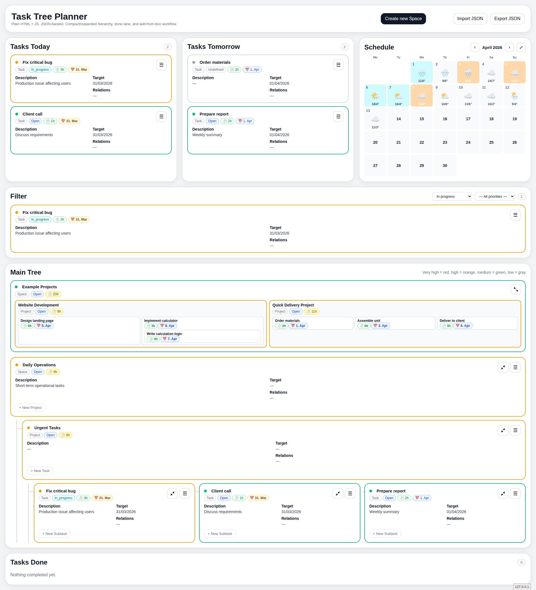

# Task Tree Planner

A self-hosted, local-first task management tool — **one HTML file + one Python file**. No framework, no database, no cloud. Your data stays on your machine as plain JSON.



---

## Features

### 🌲 Hierarchical tree
- **Space → Project → Task → Subtask** hierarchy
- Compact view: rectangle-in-rectangle nested layout showing the whole structure at a glance
- Expand/compact individual nodes with dedicated buttons
- Click any compact card to see a full-detail popup

### 📅 Schedule overview
- **Overdue / Today / Tomorrow** lanes always visible
- **Monthly calendar heatmap** — colour-coded by workload (light green → red)
- Weather forecast overlay on calendar days (requires `server.py`)
- Expandable calendar for a full-width view

### ⏱ Time tracking
- Time estimate per task (in hours, supports decimals like `2.5`)
- Automatic rollup through the tree — parent nodes show the sum of their children
- Clock pill colour: 🟢 green = scheduled, 🔴 red = no target date set
- Date tag visible on every card (e.g. `31. Mar`)

### 🎨 Visual design
- Priority-coloured card borders: 1-10 scale (1 = Low, 4 = Medium, 7 = High, 10 = Very High), color gradient from grey through green and orange to red
- Status pills: open, in_progress, blocked, done
- Image thumbnails with hover popup zoom
- Done tasks shown greyed-out with strikethrough and a × watermark

### ⌨️ Productivity
- Press **N** while hovering a card to instantly open "Add child" dialog
- Burger menu (☰) on every card: Edit, Complete, Add child, Delete
- Peek popup on click for compact cards — full card info without expanding
- Bidirectional relations between tasks
- **Reorganize from the Edit dialog**: move an item under any other parent (or to the top level), change its type (Space/Project/Task/Subtask — optionally cascading to nested items), and reorder it up/down among same-type siblings
- Searchable "Move to" and "Relates to" pickers — type to filter; in "Move to", use ↑ / ↓ / Enter to navigate and pick a match without the mouse

### 💾 Data
- All data saved to `data.json` alongside the HTML (auto-save on every change)
- Images uploaded directly to `images/` on the server
- Import / Export JSON at any time
- Works as `file://` with localStorage fallback (no server needed for basic use)

---

## Getting started

### Requirements
- Python 3.8+
- A modern browser (Chrome / Firefox / Safari)

### First run — add your first user

```bash
git clone https://github.com/yourname/task-tree-planner
cd task-tree-planner
python server.py --setup
```

You will be prompted for a username and password. Credentials are stored in `config.json` as SHA-256 hashes — plaintext passwords are never saved.

### Run

```bash
python server.py
```

Open **http://localhost:8000** in your browser. You'll see a login page.

The server binds to `0.0.0.0`, so it's reachable from other devices on your LAN (phone, tablet, other machines).

### User management

```bash
python server.py --setup           # add first user
python server.py --add-user        # add another user
python server.py --update-user     # change a user's password
python server.py --remove-user     # remove a user
python server.py --list-users      # show all usernames
```

### Optional: custom port

```bash
python server.py 9000
```

Port can also be set in `config.json` (CLI argument takes priority):

```json
{ "port": 9000 }
```

---

## File structure

```
task-tree-planner/
├── task_tree_planner.html   # The entire frontend
├── server.py                # Minimal Python HTTP server
├── backup_tasks.sh          # Hourly backup script (optional)
├── config.json.example      # Config template — copy to config.json and edit
├── data.json                # Your task data (created on first save)
└── images/                  # Uploaded images (created automatically)
```

Backups are stored one directory up (path is configurable via `config.json`):

```
../backup_ttp_personal/
  2026/
    04-April/
      2026-04-01_14-00.json
      2026-04-01_18-00.json
```

---

## Multi-instance & config.json

Copy `config.json.example` to `config.json` and edit to taste. All keys are optional — defaults are used for anything omitted.

```json
{
  "instance_name": "Personal",
  "port": 8000,
  "backup_dir": "../backup_ttp_personal"
}
```

| Key | Default | Description |
|-----|---------|-------------|
| `instance_name` | `"Task Tree Planner"` | Shown in the browser tab title |
| `port` | `8000` | Port the server listens on (CLI arg overrides this) |
| `backup_dir` | `../backup_ttp_<instance>` | Where `backup_tasks.sh` writes backups (relative to the instance directory, or absolute) |

To run two instances side by side, clone the repo twice into separate directories, give each a different `instance_name` and `port` in its `config.json`, and start both servers:

```bash
# Terminal 1 — Personal
cd ~/task-tree-planner-personal && python server.py

# Terminal 2 — Work
cd ~/task-tree-planner-work && python server.py
```

Each instance has its own `data.json`, `config.json`, `images/`, and backup directory.

---

## Backup (optional)

Place `backup_tasks.sh` next to `task_tree_planner.html`, then add a cron job:

```bash
chmod +x backup_tasks.sh
crontab -e
# Add:
0 * * * * /full/path/to/backup_tasks.sh >> /full/path/to/backup_tasks.log 2>&1
```

The script uses `md5sum` to detect changes — a backup is only written when the file has actually changed, keeping storage usage minimal.

---

## Weather (optional)

The calendar supports weather overlays via [Open-Meteo](https://open-meteo.com/) — no API key required. Configure your coordinates in `server.py`:

```python
WEATHER_LAT = 42.70   # Sofia, Bulgaria
WEATHER_LON = 23.32
```

The server fetches a 7-day forecast and caches historical weather in `weather_history.json`.

---

## Login & security

The server uses a **session cookie** authentication system with multi-user support:

- Users are stored in `config.json` as `{ "users": { "alice": "<sha256>", "bob": "<sha256>" } }`
- On successful login a random 64-character session token is set as an `HttpOnly` cookie
- Sessions expire after **7 days**
- All routes except `/login` require a valid session — unauthenticated requests redirect to the login page
- Passwords are validated with `secrets.compare_digest` (constant-time, safe against timing attacks)
- Failed login attempts are logged with the IP address but never the attempted password
- **Add `config.json` to `.gitignore`** if you push to a public repo

```
config.json  ← contains usernames + password hashes, never commit this
```

## Running as a systemd service

Create `/etc/systemd/system/task-planner.service`:

```ini
[Unit]
Description=Task Tree Planner
After=network.target

[Service]
ExecStart=/usr/bin/python3 /path/to/server.py
WorkingDirectory=/path/to/
Restart=always
User=youruser

[Install]
WantedBy=multi-user.target
```

```bash
sudo systemctl enable --now task-planner
```

---

## Keyboard shortcuts

| Key | Action |
|-----|--------|
| `N` | Add child to hovered card |
| `Esc` | Close peek popup |

---

## Data format

`data.json` is plain, human-readable JSON — easy to back up, version with git, or process with scripts:

```json
{
  "version": 1,
  "settings": { "root_ids": ["space_1"] },
  "nodes": {
    "space_1": {
      "id": "space_1",
      "type": "space",
      "name": "My Space",
      "status": "open",
      "priority": 7,
      "target_date": "2026-04-15",
      "time_estimate": null,
      "children": ["project_1"],
      "relates_to": [],
      "collapsed": false,
      "archived": false
    }
  }
}
```

Node types: `space` → `project` → `task` → `subtask`

---

## Why not use an existing tool?

Most task managers are either cloud-dependent, too heavy, or don't offer a visual hierarchy tree with time rollup and a calendar heatmap in one place. This tool is:

- **Zero dependencies** — no npm, no pip packages, no Docker
- **Yours** — data is a plain JSON file you can read, grep, and version
- **Fast** — loads instantly, saves instantly
- **Hackable** — everything is in two files, easy to modify

---

## License

MIT — do whatever you want with it.
